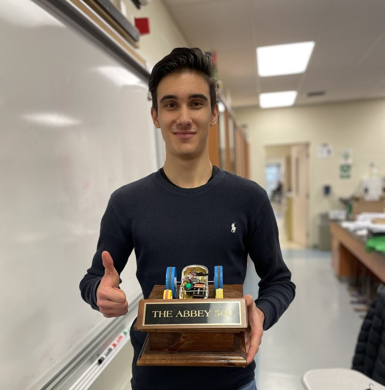

# Race-Car Project:

The purpose of the project was to design a sustainable and functional race car using any available
objects and materials necessary. The whole idea of the design was to not use any pre-built car
components and to create the fastest car. The only provided materials were the small motor and
gears needed for the movement of the car. With this in mind I creatively designed a fast and
efficient race car from a tin can resulting in me winning first place in the competition as well as
the “Abbey 500” award.

# Link to Report:
[ProjectReport.pdf](ProjectReport.pdf)

# Video Demo:

https://drive.google.com/file/d/10QWaILbvaE79JcNm-0Gb_9Luwrge31_0/view?usp=sharing
